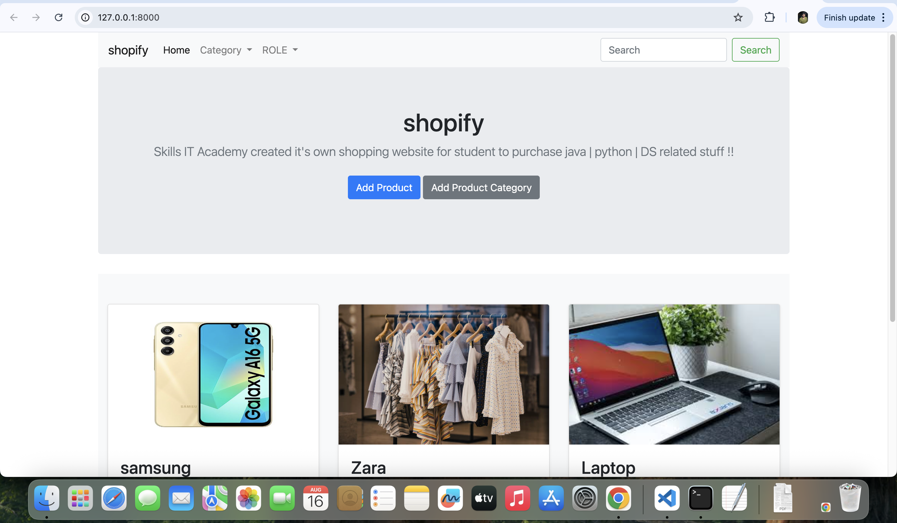
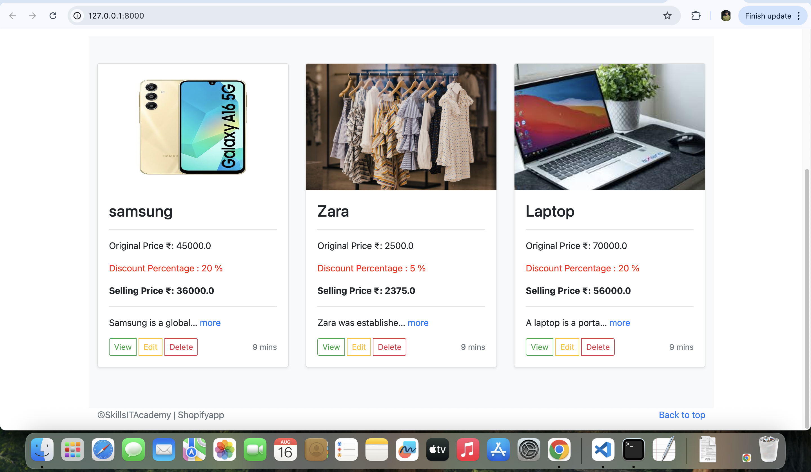
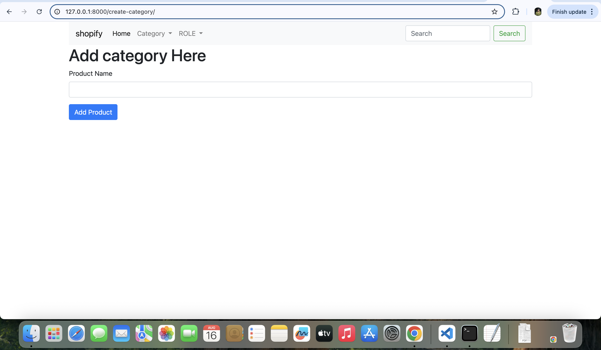
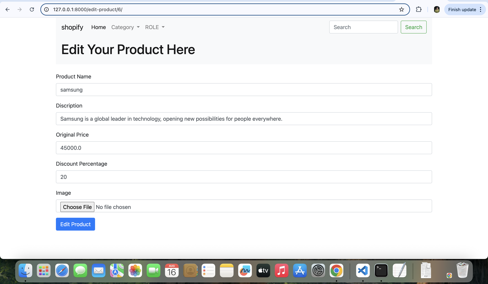

🛍️ SkillsShopify

SkillsShopify is a Django-based E-commerce Seller Platform that allows sellers to manage their products easily.
Sellers can add, edit, delete products, manage categories, apply discounts, and the system automatically calculates the selling price based on discount percentage.

🚀 Features

👤 Seller Dashboard – Manage products in categories like Electronics, Clothing, Home Appliances

➕ Product Management – Add, Edit, Delete products

🏷️ Category Management – Add categories for better organization

💰 Discount System – Apply discount % and automatically calculate final selling price

🔍 Search & Filters – Integrated search bar and dropdown filters for products

🎨 User Interface – Clean UI with Bootstrap for responsiveness

🛠 Tech Stack

Backend: Python, Django

Frontend: HTML, CSS, JavaScript, Bootstrap

Database: SQLite / MySQL

Version Control: Git & GitHub

Deployment Tools: Docker (optional)

## 📸 Screenshots

