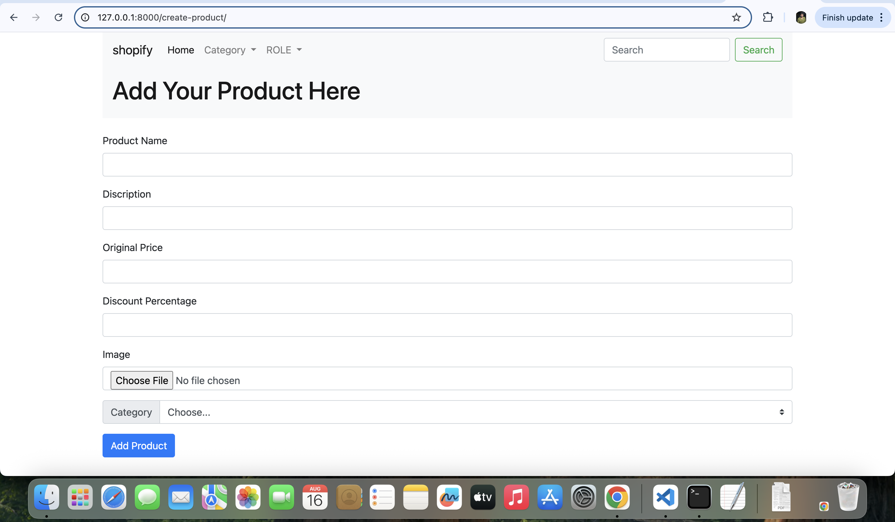

🛍️ SkillsShopify

SkillsShopify is a Django-based E-commerce Seller Platform that allows sellers to manage their products easily.
Sellers can add, edit, delete products, manage categories, apply discounts, and the system automatically calculates the selling price based on discount percentage.

🚀 Features

👤 Seller Dashboard – Manage products in categories like Electronics, Clothing, Home Appliances

➕ Product Management – Add, Edit, Delete products

🏷️ Category Management – Add categories for better organization

💰 Discount System – Apply discount % and automatically calculate final selling price

🔍 Search & Filters – Integrated search bar and dropdown filters for products

🎨 User Interface – Clean UI with Bootstrap for responsiveness

🛠 Tech Stack

Backend: Python, Django

Frontend: HTML, CSS, JavaScript, Bootstrap

Database: SQLite / MySQL

Version Control: Git & GitHub

Deployment Tools: Docker (optional)

## 📸 Screenshots

⚡ Installation & Setup

1. Clone the repository

git clone https://github.com/your-username/SkillsShopify.git

cd SkillsShopify

2. Create a virtual environment & activate it

python -m venv env

source env/bin/activate   # for Linux/Mac

env\Scripts\activate      # for Windows

3. Install dependencies

pip install -r requirements.txt

4. Run migrations

python manage.py makemigrations

python manage.py migrate

5. Start the server

python manage.py runserver

6. Open in browser
   
👉 http://127.0.0.1:8000/

📌 Future Enhancements

Integration of Recommendation System (AI/ML) for personalized suggestions

Role-based authentication (Admin, Seller, Buyer)

REST APIs for external integrations

👥 Authors

Om Jagtap
📧 : omjagtap678@gmail.com
| 🔗 : www.linkedin.com/in/om-jagtap-43060b328

Aditi Jadhav
📧 : aditijadhav214@gmail.com
| 🔗 : www.linkedin.com/in/aditijadhav-data

Prerna Mhaske
📧 : prernamhaske4@gmail.com
| 🔗 : https://www.linkedin.com/in/prerna-mhaske-data

👉 Pro tip

Add a requirements.txt file using:

pip freeze > requirements.txt
